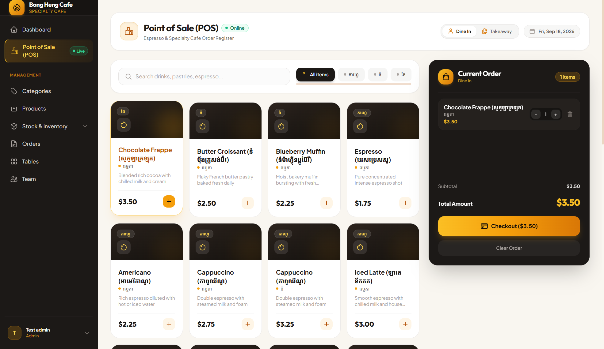
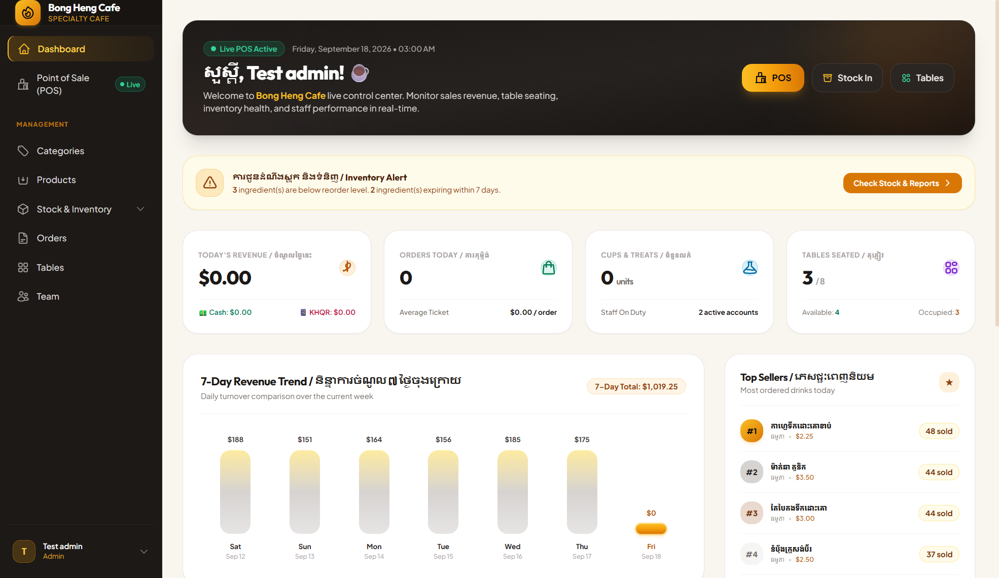
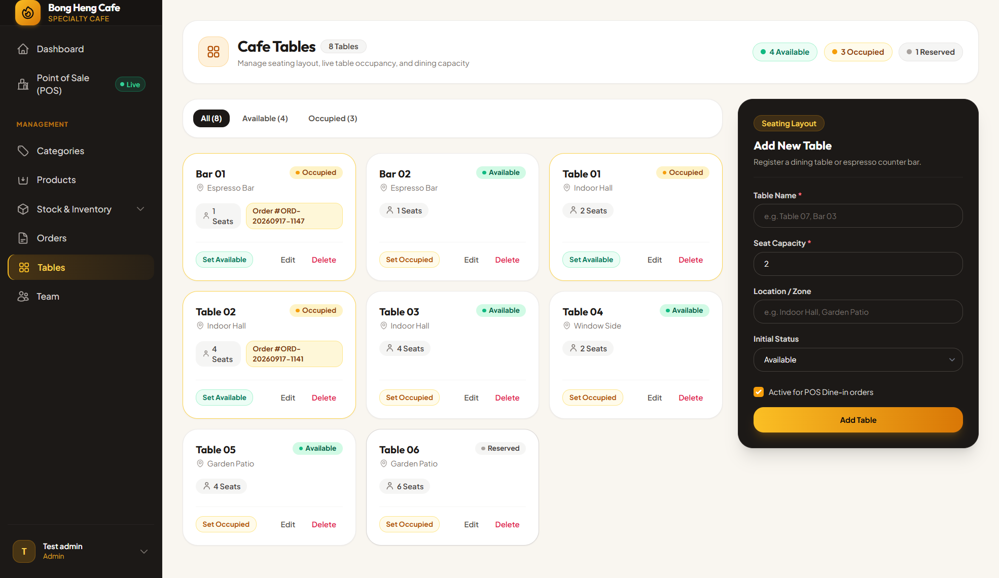
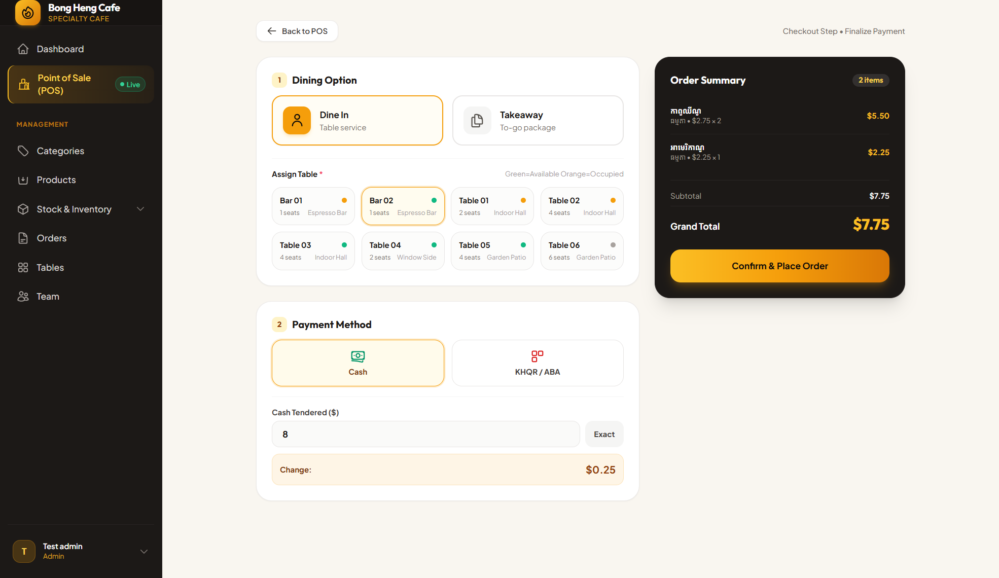
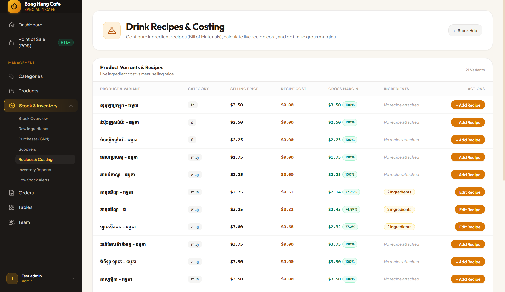
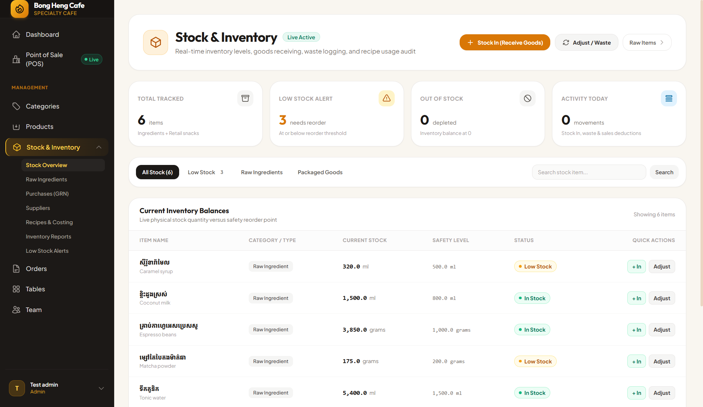
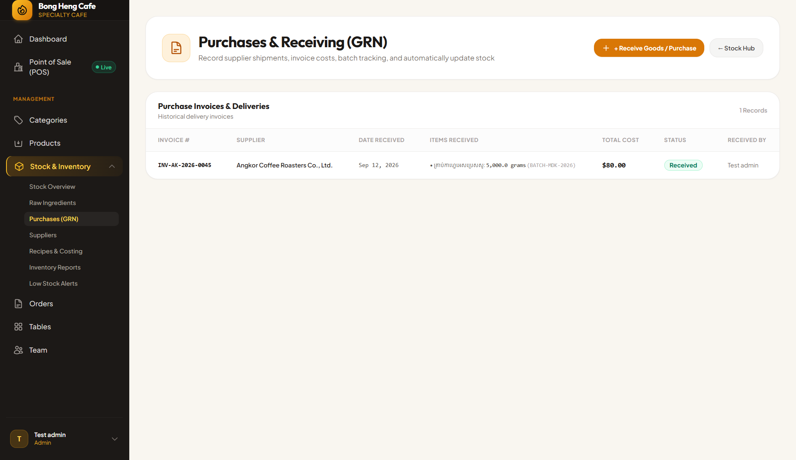
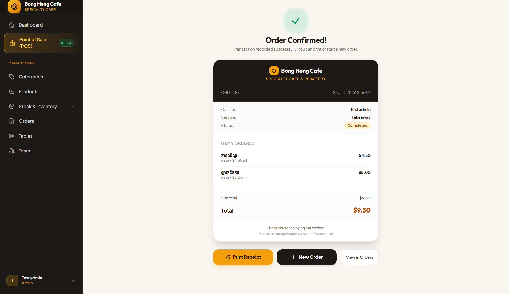

<div align="center">


# ☕ Bong Heng Café POS & Inventory Management System
### ប្រព័ន្ធគ្រប់គ្រងការលក់ និងស្តុកហាងកាហ្វេស្វ័យប្រវត្តិតាមរូបមន្តពិត (BOM)

**វិទ្យាស្ថានពហុបច្ចេកទេសភូមិភាគតេជោសែនបាត់ដំបង (RPITSB)**  
*ដេប៉ាតឺម៉ង់ព័ត៌មានវិទ្យា • កម្រិតបរិញ្ញាបត្របច្ចេកវិទ្យា • ជំនាន់ទី ១៧ • ឆ្នាំ ២០២៦*  
**គ្រូបច្ចេកទេសដឹកនាំ ៖** លោកគ្រូ **សៅ ណារ៉ុង**

<br/>

[](https://laravel.com)
[](https://www.php.net)
[](https://www.postgresql.org)
[](https://tailwindcss.com)
[](https://alpinejs.dev)
[](https://bakong.nbc.org.kh)
[-10B981?style=for-the-badge&logo=pest&logoColor=white)](https://pestphp.com)
[](https://www.php-fig.org/psr/psr-12/)

</div>

---

## 👥 ក្រុមនិស្សិតស្រាវជ្រាវ (Development Team)

| សមាជិក | តួនាទី | ការទទួលខុសត្រូវស្នូល (Core Responsibilities) |
|---|:---:|---|
| 👑 **ឡេង គឹមហេង** | **ប្រធានក្រុម** | System Architecture, Service Layer, RBAC & Executive Dashboard |
| ☕ **សេង គឹមហេង** | **សមាជិក** | Touchscreen POS Register, Floor Plan Table Management & Bakong KHQR |
| 📦 **យ៉ុម ឃី** | **សមាជិក** | Recipe BOM Engine, Inventory Deductions, COGS & Profit Margins |
| 📊 **ផល្លី សុគន្ធបញ្ញា** | **សមាជិក** | Purchases (GRN), Batch Expiry (FIFO), Stock Reports & Pest Tests (70 Tests) |

---

## ✨ ចំណុចលេចធ្លោនៃប្រព័ន្ធ (Key Innovations & Features)

* ☕ **Touchscreen POS Register (`/pos`) ៖**
  * រុករកម៉ឺនុយរហ័សតាម Category Tabs (Coffee, Tea, Frappe, Bakery)
  * Variant Switcher ឆ្លាតវៃ ៖ Regular/Large, Hot/Iced, Sugar (0% - 100%), Extra Shots
  * Live Cart Sidebar គណនាតម្លៃស្វ័យប្រវត្តិតាមរូបិយប័ណ្ណពីរ ($ និង ៛) តាមអត្រាប្តូរប្រាក់បច្ចុប្បន្ន។
* 🪑 **ការគ្រប់គ្រងតុ Floor Plan Management (`/admin/tables`) ៖**
  * គាំទ្រទាំងការញ៉ាំក្នុងហាង (Dine-In) និងខ្ចប់ទៅផ្ទះ (Takeaway)
  * ពណ៌សម្គាល់ស្ថានភាពតុ ៖ 🟢 Available (ទំនេរ), 🔴 Occupied (មានភ្ញៀវ), 🟡 Reserved (កក់ទុក)។
* ⚡ **ម៉ាស៊ីនរូបមន្ត Recipe Bill of Materials (BOM) & Auto-Deduction Engine ៖**
  * កាត់ស្តុកគ្រឿងផ្សំគ្រាប់កាហ្វេ ទឹកដោះគោ និងកែវភ្លាមៗនៅពេល Checkout
  * ការពារទិន្នន័យដោយ **Atomic Database Transactions** (`DB::transaction`) និង **Duplicate Guard** (`inventory_deducted_at`)
  * បំប្លែងខ្នាតដោយសុវត្ថិភាព ៖ ទិញចូលជា kg/L តែលក់កាត់ជា g/ml ស្វ័យប្រវត្តិតាមរូបមន្ត។
* 💰 **ការគណនាថ្លៃដើម COGS និងប្រាក់ចំណេញដុល (Gross Margin %) ៖**
  * ដឹងច្បាស់ពីថ្លៃដើមពិតក្នុងមួយកែវ ឧ. **Cappuccino Regular** (ថ្លៃដើម **$0.612** | លក់ **$2.75** ➔ ចំណេញដុល **$2.14 ឬ 77.7%**)។
* 🇰🇭 **ការទូទាត់ជាតិ Bakong Dynamic KHQR & Cash Calculator (`/checkout`) ៖**
  * បង្កើតកូដ QR ផ្ទុកចំនួនទឹកប្រាក់ និងវិក្កយបត្រជាក់លាក់ ស្កេនពី ABA, Acleda, Canadia, Wing, etc.
  * ម៉ាស៊ីនគណនាប្រាក់អាប់ Cash Calculator គណនាប្រាក់អាប់ជូនភ្ញៀវរហ័សទាន់ចិត្ត។
* 🧾 **ការបោះពុម្ពវិក្កយបត្រកម្ដៅ 80mm Thermal Receipt ៖**
  * បង្កើតវិក្កយបត្រស្វ័យប្រវត្តិ មាន Logo ហាង Bong Heng Café, លេខតុ, ព័ត៌មានលម្អិត, QR Code។
* 📦 **ការទិញទំនិញចូល Purchases / GRN & Weighted Moving Average Costing ៖**
  * កត់ត្រា Supplier, Invoice #, Batch #, ថ្ងៃផុតកំណត់ (FIFO) និងគណនាថ្លៃដើមមធ្យមស្វ័យប្រវត្តិ។

---

## 📸 រូបភាពផ្ទាំងប្រព័ន្ធជាក់ស្តែង (System Screenshots Gallery)

<table align="center">
  <tr>
    <td align="center" width="50%">
      <b>🖥️ ផ្ទាំងបញ្ជាលក់ Touchscreen POS Register</b><br/>
      
    </td>
    <td align="center" width="50%">
      <b>📊 ផ្ទាំងគ្រប់គ្រងទូទៅ Executive Dashboard</b><br/>
      
    </td>
  </tr>
  <tr>
    <td align="center" width="50%">
      <b>🪑 ការគ្រប់គ្រងតុ Floor Plan (Dine-In / Takeaway)</b><br/>
      
    </td>
    <td align="center" width="50%">
      <b>🇰🇭 ការទូទាត់ Bakong Dynamic KHQR & Cash</b><br/>
      
    </td>
  </tr>
  <tr>
    <td align="center" width="50%">
      <b>☕ តារាងរូបមន្ត Recipe BOM & Costing Matrix</b><br/>
      
    </td>
    <td align="center" width="50%">
      <b>📦 ផ្ទាំងគ្រប់គ្រងស្តុក Stock Hub & Adjustments</b><br/>
      
    </td>
  </tr>
  <tr>
    <td align="center" width="50%">
      <b>🚚 ការទិញចូល Purchases / GRN & Batch Expiry</b><br/>
      
    </td>
    <td align="center" width="50%">
      <b>🧾 វិក្កយបត្រកម្ដៅ 80mm Thermal Receipt</b><br/>
      
    </td>
  </tr>
</table>

---

## 🏗️ ស្ថាបត្យកម្មប្រព័ន្ធ (Architecture Flow)

```
[Touchscreen POS / Alpine.js]
           │
           ▼
[CheckoutController] ──────► [KhqrService] ──► [NBC Bakong KHQR]
           │
           ▼
   [DB::transaction]
           │
           ├─► [Order & OrderItems Creation]
           ├─► [InventoryService: Recipe BOM Deduction]
           │         │
           │         ├─► Coffee Beans (-18g)
           │         ├─► Fresh Milk (-180ml)
           │         └─► Hot Paper Cup (-1 pc)
           │
           ├─► [CafeTable Status: Available ➔ Occupied]
           └─► [Table Audit: stock_movements]
           │
           ▼
[PostgreSQL Database: High-Precision decimal(10,4)]
           │
           ▼
[80mm Thermal Receipt Printer Output]
```

---

## 🚀 ការដំឡើង និងដំណើរការគម្រោង (Installation & Setup)

### ១. ទាញយកគម្រោង (Clone Repository)
```bash
git clone https://github.com/SE7EN-01/CafePos_PHP_Final.git
cd CafePos_PHP_Final
```

### ២. ដំឡើង Dependencies
```bash
composer install
npm install
```

### ៣. រៀបចំ Environment File
```bash
cp .env.example .env
php artisan key:generate
```

កំណត់ការតភ្ជាប់ Database ក្នុង `.env` (PostgreSQL) ៖
```env
DB_CONNECTION=pgsql
DB_HOST=127.0.0.1
DB_PORT=5432
DB_DATABASE=coffee_shop_db
DB_USERNAME=postgres
DB_PASSWORD=your_password
```

### ៤. Migrate និង Seed ទិន្នន័យជាក់ស្តែង
```bash
php artisan migrate:fresh --seed
```

### ៥. Build Frontend និងដំណើរការ Server
```bash
npm run build
php artisan serve
```
ចូលទៅកាន់ Website ៖ `http://127.0.0.1:8000`

---

## 🔐 គណនីគំរូសម្រាប់សាកល្បង (Demo Accounts)

| តួនាទី (Role) | Email | Password | សិទ្ធិប្រើប្រាស់ (Access Level) |
|---|---|---|---|
| 👑 **Manager / Admin** | `admin@cafe.com` | `admin` | Dashboard, Stock Hub, Recipes BOM, Purchases, Settings, Staffs |
| ☕ **Barista Staff** | `barista@cafe.com` | `barista` | POS Touchscreen, Table Ordering, Checkout & Receipts |

---

## 🧪 ការធ្វើតេស្តស្វ័យប្រវត្តិ (Automated Testing with Pest PHP)

គម្រោងនេះប្រកាន់ខ្ជាប់នូវបទដ្ឋានវិស្វកម្មសូហ្វវែរ ដោយឆ្លងកាត់ការធ្វើតេស្តស្វ័យប្រវត្តិគ្រប់មុខងារស្នូល ៖

```bash
php artisan test
```

```text
   PASS  Tests\Unit\ExampleTest
  ✓ that true is true

   PASS  Tests\Feature\PosTest
  ✓ barista can access pos screen
  ✓ active products and categories are displayed
  ✓ regular variant price displays correctly

   PASS  Tests\Feature\InventoryServiceTest
  ✓ inventory service deducts correct ingredient amount via recipe
  ✓ duplicate deduction guard prevents double deducting same order
  ✓ atomic rollback occurs if stock is insufficient

   PASS  Tests\Feature\AdminManagementTest
   PASS  Tests\Feature\AdminSettingTest

  Tests:    70 passed (244 assertions)
  Duration: 3.75s
```
> **លទ្ធផល ៖** **70 / 70 Tests Passing (100% Green)** • **244 Assertions** ដំណើរការត្រឹមត្រូវឥតខ្ចោះ!

---

## 📜 អាជ្ញាបណ្ណ និងកម្មសិទ្ធិ (License)
គម្រោងស្រាវជ្រាវនេះត្រូវបានអភិវឌ្ឍឡើងសម្រាប់ការពារបញ្ចប់ការសិក្សាកម្រិតបរិញ្ញាបត្របច្ចេកវិទ្យា នៅ **វិទ្យាស្ថានពហុបច្ចេកទេសភូមិភាគតេជោសែនបាត់ដំបង (RPITSB)** ក្រោមការណែនាំរបស់ **លោកគ្រូ សៅ ណារ៉ុង**។ រក្សាសិទ្ធិគ្រប់យ៉ាង © ២០២៦។
